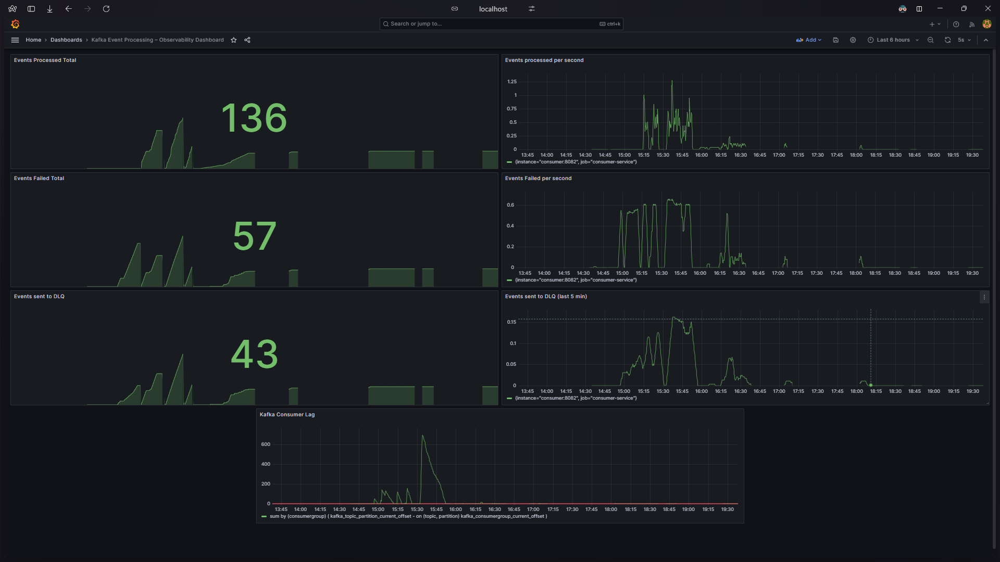
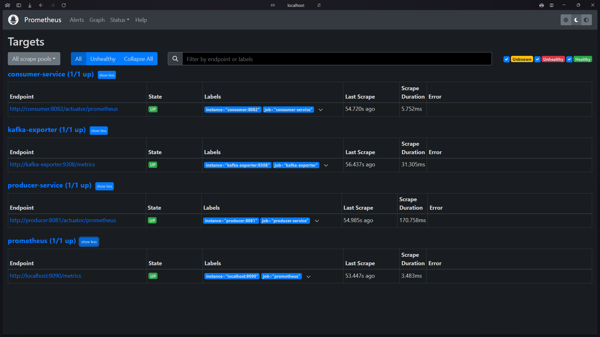

# ⚡ Kafka Event Processing Platform

A **production-style event-driven system** built with Spring Boot, Kafka, PostgreSQL, Redis, Prometheus, and Grafana — demonstrating the patterns real engineering teams use to build reliable, observable data pipelines.

This isn't a tutorial project. It's a working implementation of the decisions that matter in production: idempotency, dead letter queues, consumer lag monitoring, and end-to-end observability from a single `docker compose up`.

---

## 🤔 The Problem This Demonstrates

Most Kafka tutorials show you how to publish and consume a message. They skip the hard parts: what happens when a message is processed twice? What happens when a consumer crashes mid-batch? How do you know your consumer is falling behind before it becomes an incident?

This platform answers all three.

---

## 🏗️ Architecture

```
REST Client
     │
     ▼
Producer Service (Spring Boot :8081)
     │  publishes to
     ▼
Kafka Topic: user.activity.events
     │
     ▼
Consumer Service (Spring Boot :8082)
     ├── Redis          ──→ Deduplication (idempotency key per eventId)
     ├── PostgreSQL     ──→ Aggregated event storage
     └── DLQ Topic      ──→ Failed events quarantined for inspection
     │
     ▼
Prometheus (:9090)     ──→ Scrapes app + Kafka Exporter metrics
     │
     ▼
Grafana (:3000)        ──→ Real-time dashboards + consumer lag tracking
```

---

## ⚙️ Engineering Decisions Worth Noting

### 🔁 Idempotent Consumer with Redis
Every event carries an `eventId`. Before processing, the consumer checks Redis for that ID. If it exists, the event is a duplicate and is silently dropped. If not, processing proceeds and the ID is written to Redis atomically. This guarantees **exactly-once processing semantics** even when Kafka redelivers messages after a consumer crash.

### 🪦 Dead Letter Queue (DLQ) Handling
Events that fail processing after retries aren't lost — they're routed to a dedicated DLQ topic. This means failed events can be inspected, replayed, or alertted on without blocking the main consumer or losing data.

### 📈 Kafka Consumer Lag Monitoring
Consumer lag is the leading indicator of pipeline health — a growing lag means your consumer is slower than your producer, and you'll have a problem before users notice. This is tracked via **Kafka Exporter** feeding Prometheus, with a PromQL query that computes lag per consumer group:

```promql
sum by (consumergroup) (
    kafka_topic_partition_current_offset
    -
    on (topic, partition)
    kafka_consumergroup_current_offset
)
```

### 🐳 Full Observability Stack in Docker Compose
The entire system — Kafka, Zookeeper, producer, consumer, Redis, PostgreSQL, Prometheus, Grafana, and Kafka Exporter — starts with one command. No manual config, no separate setup steps.

---

## 📊 Metrics Tracked

| Metric | What It Tells You |
|--------|------------------|
| `events_processed_total` | Throughput baseline |
| `events_failed_total` | Error rate |
| `events_duplicate_total` | How often idempotency is saving you |
| `events_dlq_total` | Events needing manual intervention |
| Kafka consumer lag | Whether the pipeline is keeping up |

---

## 🚀 Getting Started

**Prerequisites:** Docker, Docker Compose

```bash
docker compose up -d
```

That's it. All services start automatically.

| Service | URL |
|---------|-----|
| Producer API | http://localhost:8081 |
| Consumer Metrics | http://localhost:8082/actuator/prometheus |
| Prometheus | http://localhost:9090 |
| Grafana | http://localhost:3000 (admin / admin) |

### Send a Test Event

```bash
curl -X POST http://localhost:8081/events \
  -H "Content-Type: application/json" \
  -d '{
    "eventId": "e1",
    "userId": "u1",
    "eventType": "CLICK",
    "timestamp": 1710000000000
  }'
```

Send the same request twice — the second event will be detected and dropped by the idempotency layer. You'll see `events_duplicate_total` increment in Prometheus.

---

## 🛠️ Tech Stack

**Services:** Spring Boot (producer + consumer), Apache Kafka, Redis, PostgreSQL

**Observability:** Prometheus, Grafana, Kafka Exporter, Spring Boot Actuator

**Infrastructure:** Docker, Docker Compose

---

## 📉 Grafana Dashboard

The pre-built dashboard (available under `docs/grafana/dashboard.json`) includes:

- Events processed total and per-minute rate
- Failed events and DLQ events (rolling windows)
- Kafka consumer lag over time per consumer group



